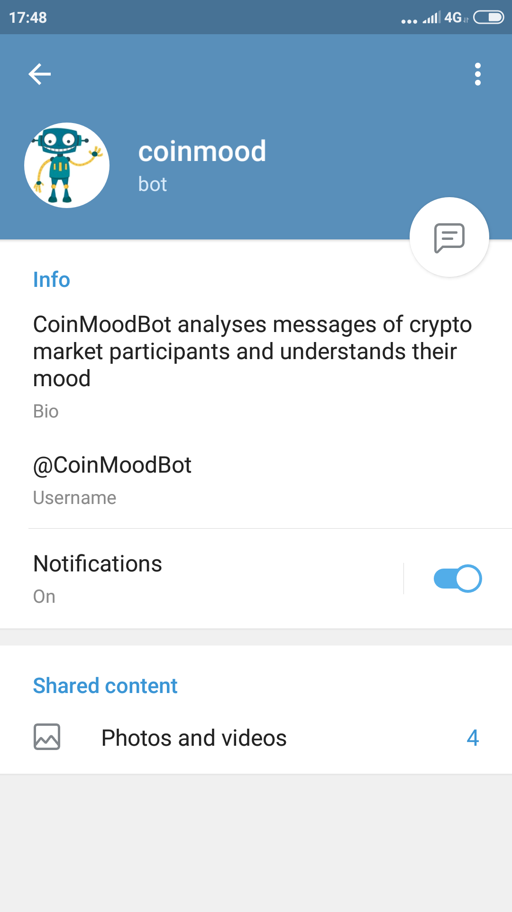
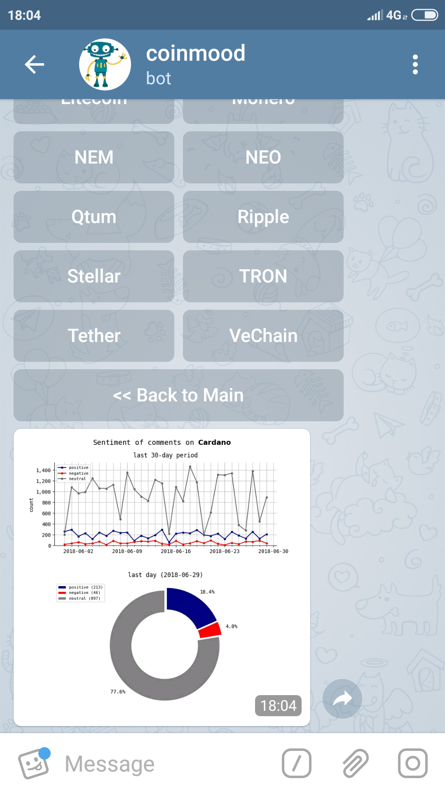

## CoinMoodBot

Telegram bot which analyses text messages of crypto market participants in Twitter and recognizes their mood.  
This analytics might be helpful to support investment decisions.

#### Pipeline  
CoinMoodBot is deployed on Heroku server.  
Main packages:
- `tweepy` - to search for target messages containing key words
- `NLTK` - to process text data
- `scikit-learn` - to perform sentiment analysis on tweets
- `matplotlib` - to plot sentiment analysis results
 

Other infrastructure tools:
- `PostgreSQL` - to store sentiment analysis output and users' feedback
- `Amazon Web Services (AWS)` - to store charts in PNG format
- `Chatbase` - to collect data for analytics (users' logs)

 

#### Screenshots
  